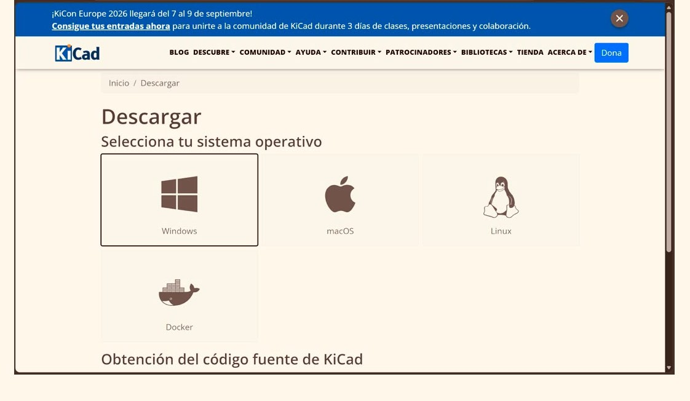

# Guía Definitiva: Flujo de Trabajo Integrado (KiCad + Mods + Roland SRM-20)

Esta es la guía estandarizada para la elaboración, exportación y fabricación de placas de circuito impreso (PCB) mediante fresado CNC local, integrando el repositorio especializado de componentes (`fablib`).

---

## Autores del Proyecto

<table width="100%">
  <tr>
    <td align="center" valign="top" width="50%">
      
      <b>Sebastian Gomez Rodriguez</b>
       
      204486
    </td>
    <td align="center" valign="top" width="50%">
      
      <b>Erik Andre Zepeda Tapia</b>
       
      204440
    </td>
  </tr>
</table>

---

## Tabla de Contenido
- [1. Introducción y Arquitectura del Entorno](#1-introducción-y-arquitectura-del-entorno)
- [2. Configuración y Despliegue de Librerías (Fab Lab)](#2-configuración-y-despliegue-de-librerías-fab-lab)
- [3. Maquetación del Editor de Esquemas (Schematic Editor)](#3-maquetación-del-editor-de-esquemas-schematic-editor)
- [4. Enrutamiento y Diseño de Placas (PCB Editor)](#4-enrutamiento-y-diseño-de-placas-pcb-editor)
- [5. Validación Avanzada (DRC) y Salidas de Fabricación](#5-validación-avanzada-drc-y-salidas-de-fabricación)
- [6. Flujo de Preparación CAM y Maquinado CNC (Roland SRM-20)](#6-flujo-de-preparación-cam-y-maquinado-cnc-roland-srm-20)

---

## 1. Introducción y Arquitectura del Entorno

El gestor de proyectos de KiCad opera como el núcleo centralizador para la administración de jerarquías, esquemáticos, bases de datos de huellas y archivos de salida de manufactura.

### Panel de Control

---

## 2. Configuración y Despliegue de Librerías (Fab Lab)

Para garantizar la compatibilidad con los estándares de prototipado rápido, es indispensable inicializar el software e integrar el repositorio especializado de componentes.

> 🔗 [Portal oficial de descargas de KiCad](https://www.kicad.org/download/)

### Proceso de Configuración Inicial

1. **Selección de Plataforma:** Configure el instalador acorde a su entorno de ejecución (Windows, macOS, Linux o contenedores Docker).

2. **Espejos de Red:** Seleccione un servidor de distribución geográficamente cercano para optimizar la velocidad y estabilidad de descarga.

### Integración de `fablib`

1. Acceda al menú superior **Herramientas** e inicie el **Administrador de complementos y contenidos**.
2. Localice `FABLIB` en el repositorio de bibliotecas, ejecute la descarga, seleccione **Aplicar cambios pendientes** y cierre el asistente.
3. **Acción crítica:** Reinicie la instancia de KiCad para forzar la indexación de los nuevos símbolos y huellas en el árbol del sistema.

---

## 3. Maquetación del Editor de Esquemas (Schematic Editor)

El entorno esquemático define la topología lógica del circuito, estableciendo relaciones funcionales mediante símbolos normalizados.

### Topología Esquemática Completa

Diagrama integral estructurado por bloques funcionales (alimentación, interfaces de control, elementos activos y etiquetas de red):

### Flujo de Trabajo y Buenas Prácticas

- **Unidades métricas:** Configure la retícula de trabajo en milímetros (`mm`) para mantener parámetros de escala normalizados.
- **Instanciación de Componentes (`A`):** Invoque el selector de símbolos filtrando por `fablib` (ej. resistencias SMD 1206, microcontroladores como SeeedStudio XIAO RP2040, opto-dispositivos, conectores). Utilice la tecla **`R`** para orientarlos espacialmente.

- **Conectividad y Redes (`W` / `L`):** Enrute nodos cercanos con trazos directos o implemente etiquetas de red globales (`VDD`, `GND`, líneas de control) para evitar la saturación visual del plano.

- **Jerarquización Visual:** Emplee bloques delimitadores y comentarios de texto estructurado para documentar secciones críticas del circuito.

- **Validación Lógica (ERC):** Ejecute el Verificador de Reglas Eléctricas (agregando etiquetas `PWR_FLAG` en líneas de corriente de entrada si es necesario) para certificar la ausencia de pines flotantes o conflictos de alimentación.

---

## 4. Enrutamiento y Diseño de Placas (PCB Editor)

Esta fase traduce la abstracción lógica en una topometría física, estableciendo dimensiones de tarjeta, restricciones de espacio y trazos de cobre.

### Interfaz del Editor de Circuitos Impresos

Resultado físico de la PCB con contorno personalizado, pistas optimizadas sobre la capa superior de cobre (`F.Cu`) y validación volumétrica mediante el **Visor 3D** (`Ver > Visor 3D`):

### Secuencia de Implementación

1. **Sincronización de Datos (`F8`):** Ejecute **Actualizar la placa desde el esquemático** para importar la netlist y huellas. Distribuya los módulos en el área de trabajo.

2. **Gestión de Capas:** Centre el diseño operativo en `F.Cu` para interconexiones frontales y `Edge.Cuts` para la geometría de contorno.

3. **Restricciones de Pistas y Ruteo:**  
   - Configure las clases de red y anchos predefinidos en **Editar tamaños predefinidos**: establezca **`0.4 mm`** para trazos de señal/alimentación y **`0.8 mm`** (o **`2.0 mm`** según requerimiento de contorno) para pistas perimetrales o de potencia crítica.
   - Ejecute el trazado mediante la herramienta Ruta (`X`), prefiriendo cambios de dirección a **45°** para optimizar el recorrido de la fresa y evitar trampas de cobre.

> **Nota de diseño para cruces:** Ante la imposibilidad de ruteo en una sola capa, integre un puente físico mediante una resistencia de `0 ohms` en la etapa esquemática y sincronice los cambios.
> 
> 

4. **Detalles Mecánicos, Perímetros y Planos:**
   - Defina geometrías de tarjeta cerradas en la capa `Edge.Cuts`, asignando un grosor de trazo exacto de **`2.0 mm`** optimizado para coincidir con el diámetro de la fresa CNC de corte perimetral.
   - Incorpore referencias serigráficas de texto (`T`) y matrices de perforación paramétricas (`Ctrl + T`).
   - Genere planos de tierra mediante zonas de relleno (`Ctrl + Shift + Z`) y actualice polígonos con la tecla **`B`**.

---

## 5. Validación Avanzada (DRC) y Salidas de Fabricación

### Verificación de Reglas de Diseño (DRC)

- Establezca los parámetros de separación (*clearance*) y restricciones térmicas en las directrices de diseño.
- Ejecute el **Verificador de Reglas de Diseño (DRC)** para certificar la inexistencia de cortocircuitos, pistas anómalas o claros fuera de tolerancia.

### Generación de Archivos de Producción

1. Acceda a **Archivo > Exportar > SVG...** (o *Trazar > SVG*) para compilar paquetes vectoriales de producción.
2. **Ajustes clave de exportación:** Seleccione el modo de impresión en **Blanco y negro** (*Black and white*) y active la opción **Área de la placa únicamente / Ajustar página a la placa** (*Board area only*) para evitar bordes blancos que descalibren el origen (0,0) en el maquinado.
3. Exporte de forma independiente las capas esenciales: `pistas.svg` (F.Cu), `contorno.svg` (Edge.Cuts) y `perforaciones.svg`.

---

## 6. Flujo de Preparación CAM y Maquinado CNC (Roland SRM-20)

### 1. Carga en la Plataforma CAM (Mods)
- Abra la plataforma web oficial: [Mods Community (Servidor recomendado)](https://modsproject.org/).
- Seleccione el programa correspondiente: `Programs > Open Program > Roland SRM-20 milling machine > mill 2D PCB`.

### 2. Configuración de Parámetros por Operación

| Operación | Archivo Cargado | Herramienta / Broca | Velocidad | Configuración en Mods |
| --- | --- | --- | --- | --- |
| **1. Perforaciones** | `perforaciones.svg` | Broca de taladrado 0.8 mm (1/32") | 0.3 – 0.4 mm/s | Profundidad por pasada: 0.254 mm. Profundidad total: 1.7 mm. |
| **2. Trazos / Pistas** | `pistas.svg` | Cortador V-Bit / 0.4 mm (1/64") | 4.0 mm/s | **Activar casilla Invert** (lo negro es lo que removerá la broca). Offset number: 4. |
| **3. Corte de Contorno** | `contorno.svg` | Fresa de corte 2.0 mm | 1.5 – 4.0 mm/s | Profundidad total: 1.7 mm (atraviesa la placa FR4). Offset number: 1. |

### 3. Secuencia Obligatoria de Maquinado en la CNC
1. **Paso 1: Perforaciones (Drill):** Se ejecuta en primer lugar, mientras la placa de cobre conserva toda su rigidez y área de sujeción sobre la mesa, evitando que el esfuerzo del taladrado levante el material.
2. **Paso 2: Trazado de Pistas (Traces):** Graba los canales de insulado alrededor de las rutas de cobre.
3. **Paso 3: Corte de Contorno (Cutout):** Es la última operación; recorta la periferia dibujada en `Edge.Cuts` y separa la tarjeta terminada del panel base.
