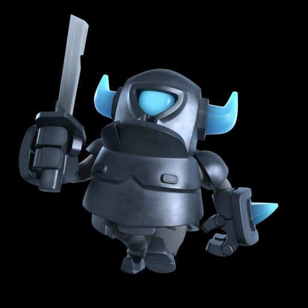

# ¿Quien soy?
Mi nombre es Erik y actualmente estoy estudiando Ingenieria Mecatronica en la Ibero Puebla.

En esta pagina resumire todos los proyectos que realice, con el fin de compartir mis conocimientos y aportes a la Mecatronica.
# Intereses y Areas de enfoque:
- Me gusta aprender mucho todo lo que tiene que ver con informatica, tecnologia, innovacion y todo ello.
- Me gusta la intregacion de objetos que usamos en la vida cotidiana a la tecnologia.
- Me enfoco en los programas de modelado de piezas 3D

# Mis aptitudes son:
- Trabajo eficiente 
- Resolucion de problemas 
- Trabajo en equipo 
- Facilidad de aprendizaje

# ¿De que me siento orgulloso?
En mi trayectoria por la preparatoria estuve involucrado en todo tipo de proyectos, buscando que estos me enseñaran algo y que me divirtiesen.
Me siento realmente orgulloso de haber sido parte de todo lo que fue eventos escolares fuertes, participe como produccion ejecutiva en la obra escolar que es una obra de primer nivel, presidente de logistica en la Sociedad de Alumnos de mi preparatoria, rol importante en el equipo representativo de Basquetbol siendo seleccionado para las competencias estatales entre colegios jesuitas en 2024 y 2025.

 Erik André Zepeda Tapia | contacto: 204440@iberopuebla.mx 

 ---
 

